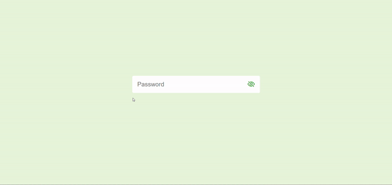
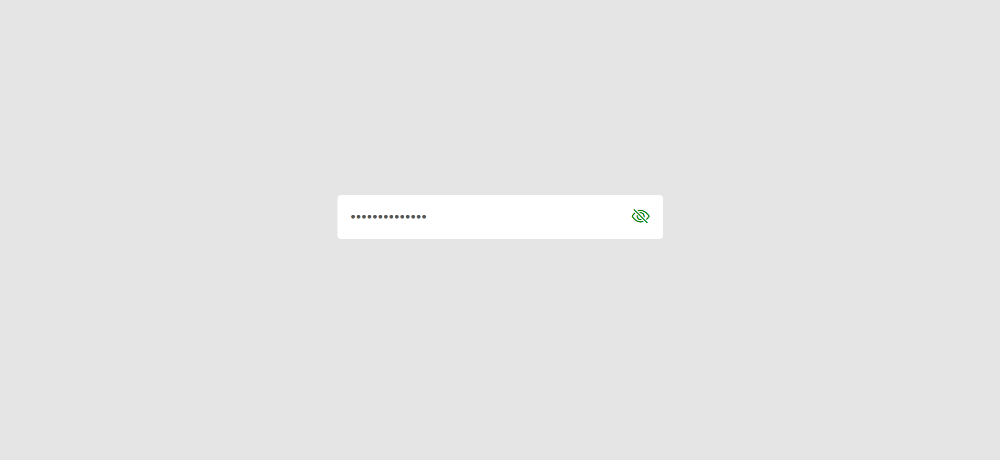
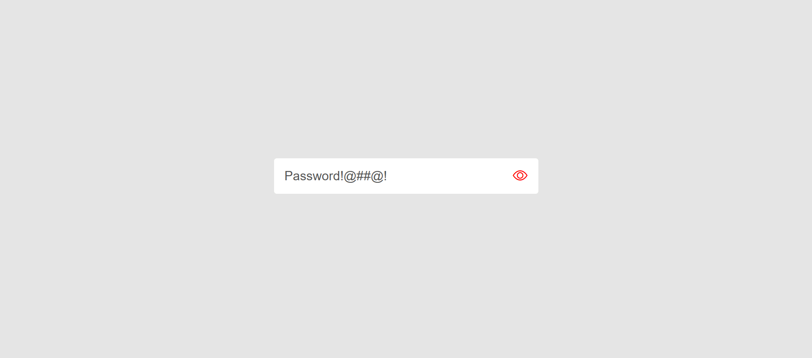
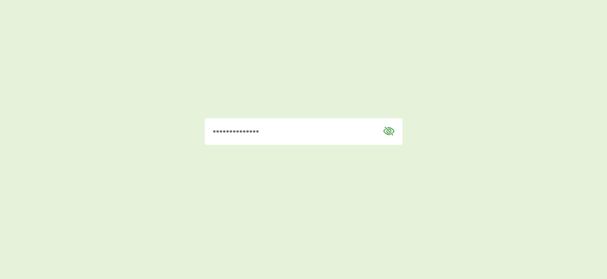
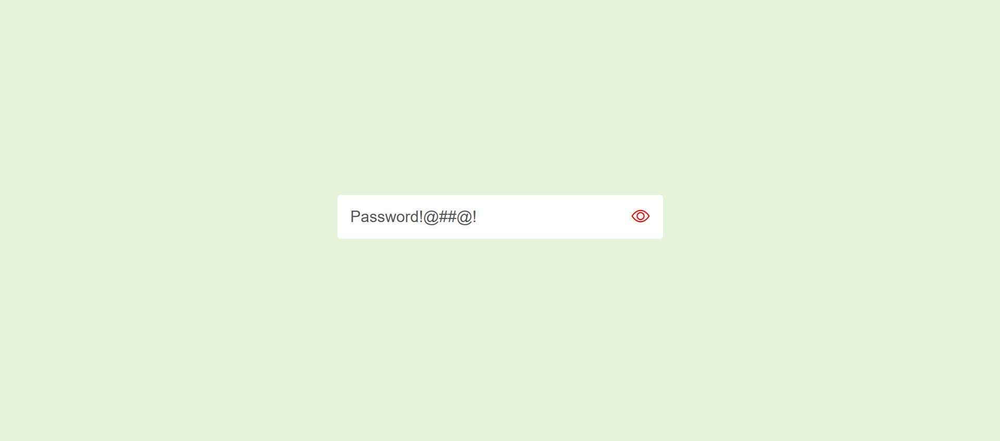
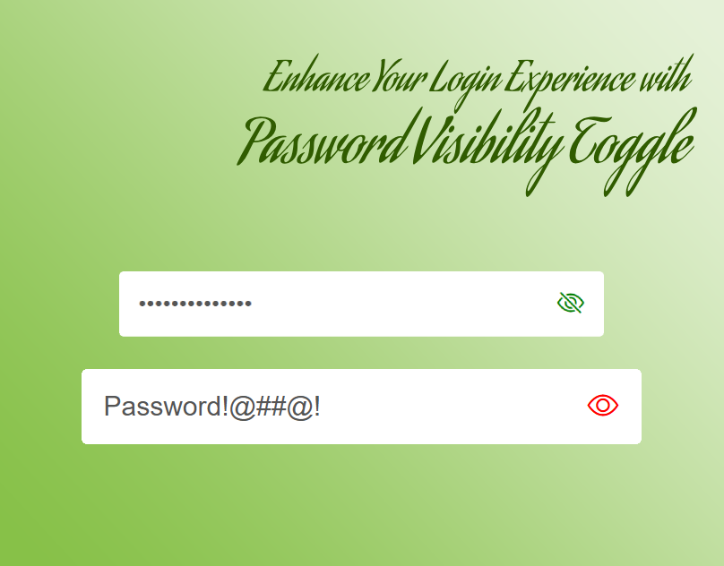

## Enhance Your Login Experience with Password Visibility Toggle
<a href="https://www.linkedin.com/in/dharmendraverma95/" target="_blank">LinkedIn Profile </a>

<a href="https://www.behance.net/dhirukumar" target="_blank">Behance Profile </a>

## OVERVIEW
This project implements a password visibility toggle feature to enhance the user experience during login. It allows users to hide and show their passwords by clicking an eye icon within the password field. This simple but effective feature helps users input passwords more accurately and ensures they are not typing incorrectly due to hidden characters.

### DragList
-- A Simple, Intuitive Drag-and-Drop Item List Manager --

## Features 
<ul>
  <li>Show/Hide Password: Users can toggle the visibility of their password by clicking on an eye icon within the password input field.</li>
  <li>User-Friendly Interface: The toggle button is easily accessible and intuitive to use.</li>
  <li>Improved Security: When the password is hidden, it ensures that sensitive information is not visible to others nearby.</li>
  <li>Responsive Design: The feature works seamlessly across different screen sizes and devices.</li>
</ul>

###### Lang
<ul>
  <li>HTML5</li>
  <li>CSS3</li>
  <li>Bootstrap Icon</li>
  <li>ChatGPT [For Content]</li>
  <li>ui / ui layout Design</li>
  <li>desgin in Abode XD</li>
</ul>

 
Desktop Design 

 
Desktop UI UX Design 

 
Desktop Design ui-ux Layout 

 
Desktop Design 

Cover 
